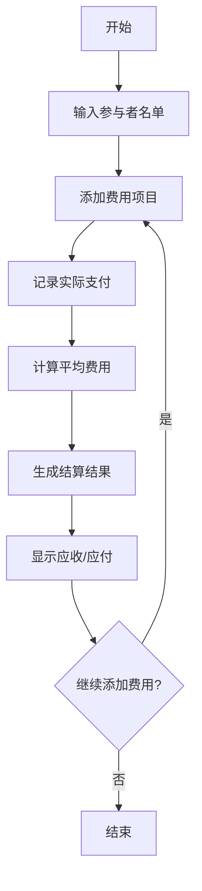

# AA计算器 - 轻松管理多人费用分摊

> 一个高效、直观的Web应用，帮助您在各种场景下轻松计算和分摊费用

## 项目概述

这是一个基于Web的多人平均费用计算应用，可以帮助朋友、同事或家庭成员在聚餐、旅行、合租等场景中快速计算每个人应该支付的费用，实现公平分摊。

## 使用场景

### 1. 朋友聚餐
- 多人一起吃饭，有人付现金，有人用支付宝/微信支付
- 需要计算每个人应该支付的平均费用
- 支持不同支付方式的记录

### 2. 旅行费用分摊
- 多人旅行中的住宿、交通、餐饮等费用
- 部分费用由个人垫付
- 需要最终结算每个人应收/应付的金额

### 3. 合租生活费用
- 水电费、燃气费、网络费等公共费用
- 需要按人数平均分摊
- 支持月度费用记录和统计

### 4. 团队活动费用
- 公司团建、团队建设活动
- 活动物资采购费用
- 需要按参与人数分摊

## 解决方案

### 核心功能
1. **费用录入**：支持添加多个费用项目
2. **参与者管理**：添加/删除参与者
3. **支付记录**：记录每个人的实际支付金额，支持零金额支付记录
4. **自动计算**：计算平均费用和结算金额，确保包含所有参与者（包括支付金额为0的参与者）
5. **结果展示**：清晰显示每个人的应收/应付金额

### 技术实现
- **前端**：HTML + CSS + JavaScript
- **部署**：GitHub Pages
- **数据存储**：本地存储（LocalStorage）

## 应用流程图

## 详细流程说明

### 1. 参与者设置阶段
- 用户输入所有参与者的姓名
- 系统验证参与者数量（至少2人）

### 2. 费用录入阶段
- 为每个费用项目输入：
  - 费用描述
  - 总金额（可以为0）
  - 支付人
- 支持添加多个费用项目
- 支持记录零金额支付，确保所有参与者都被包含在计算中

### 3. 计算阶段
- 计算所有费用的总和
- 计算每人应付的平均金额
- 对比实际支付金额与应付金额
- 生成结算清单

### 4. 结果展示阶段
- 显示每个人的应收/应付金额
- 提供清晰的结算建议
- 支持数据导出

## 部署计划

1. 开发完整的Web应用
2. 创建GitHub仓库
3. 配置GitHub Pages
4. 测试在线功能
5. 发布上线

## 更新日志

### 最新更新
- **性能优化**：计算管理器中轮次数据获取方式从复杂查找改为直接索引访问，显著提升性能
- **代码重构**：费用管理器中updateExpense方法参数调整，使用currentRound对象替代索引，提高代码可维护性
- **UI简化**：页面标题简化为"AA计算器"，界面更加简洁
- **截图功能增强**：添加SVG渲染支持、表格样式优化和延迟清理临时元素，提升截图质量
- **优化计算结果展示**：重新设计了计算结果的展示方式，各轮次计算结果和所有轮次统计结果分别组织为独立的整体区块
- **修复计算逻辑**：确保包含支付金额为0的参与者，使计算更加公平准确

## 使用方法

1. **添加参与者**：输入所有需要参与费用分摊的人员姓名
2. **添加费用项目**：为每个费用输入描述、金额和支付人
3. **计算结果**：系统自动计算每个人的平均费用和结算金额
4. **保存结果**：使用截图功能保存计算结果，方便分享和记录

## 预期效果

- 界面简洁友好，操作直观
- 计算结果准确公平
- 支持多种使用场景
- 响应式设计，适配不同设备

## 技术栈

- **前端框架**：原生JavaScript
- **样式**：CSS3
- **数据存储**：LocalStorage
- **部署**：支持GitHub Pages等静态网站托管服务
- 计算准确，结果清晰，支持各种支付场景
- 支持移动端访问
- 支持将计算结果导出为图片，方便分享和保存

## 功能亮点

### 1. 结构化的结果展示
- 各轮次计算结果作为独立整体区块，包含本轮实际支出清单和转账关系清单
- 所有轮次统计结果汇总展示，包含每轮支出概览和最终转账清单
- 清晰的视觉层次和美观的表格设计，提升用户体验

### 2. 截图保存功能
- 一键将计算结果保存为高清图片
- 自动生成包含日期的文件名
- 支持在移动端和桌面端使用
- 友好的加载提示和错误处理
- 数据本地保存，保护隐私
- 完全免费使用