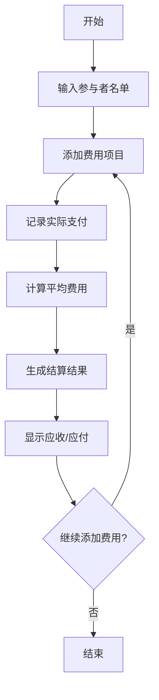

# 多人平均费用计算应用

## 项目概述

这是一个基于Web的多人平均费用计算应用，可以帮助朋友、同事或家庭成员在聚餐、旅行、合租等场景中快速计算每个人应该支付的费用，实现公平分摊。

## 使用场景

### 1. 朋友聚餐
- 多人一起吃饭，有人付现金，有人用支付宝/微信支付
- 需要计算每个人应该支付的平均费用
- 支持不同支付方式的记录

### 2. 旅行费用分摊
- 多人旅行中的住宿、交通、餐饮等费用
- 部分费用由个人垫付
- 需要最终结算每个人应收/应付的金额

### 3. 合租生活费用
- 水电费、燃气费、网络费等公共费用
- 需要按人数平均分摊
- 支持月度费用记录和统计

### 4. 团队活动费用
- 公司团建、团队建设活动
- 活动物资采购费用
- 需要按参与人数分摊

## 解决方案

### 核心功能
1. **费用录入**：支持添加多个费用项目
2. **参与者管理**：添加/删除参与者
3. **支付记录**：记录每个人的实际支付金额
4. **自动计算**：计算平均费用和结算金额
5. **结果展示**：清晰显示每个人的应收/应付金额

### 技术实现
- **前端**：HTML + CSS + JavaScript
- **部署**：GitHub Pages
- **数据存储**：本地存储（LocalStorage）

## 应用流程图

## 详细流程说明

### 1. 参与者设置阶段
- 用户输入所有参与者的姓名
- 系统验证参与者数量（至少2人）

### 2. 费用录入阶段
- 为每个费用项目输入：
  - 费用描述
  - 总金额
  - 支付人
- 支持添加多个费用项目

### 3. 计算阶段
- 计算所有费用的总和
- 计算每人应付的平均金额
- 对比实际支付金额与应付金额
- 生成结算清单

### 4. 结果展示阶段
- 显示每个人的应收/应付金额
- 提供清晰的结算建议
- 支持数据导出

## 部署计划

1. 开发完整的Web应用
2. 创建GitHub仓库
3. 配置GitHub Pages
4. 测试在线功能
5. 发布上线

## 预期效果

- 界面简洁友好，操作直观
- 计算准确，结果清晰
- 支持移动端访问
- 数据本地保存，保护隐私
- 完全免费使用